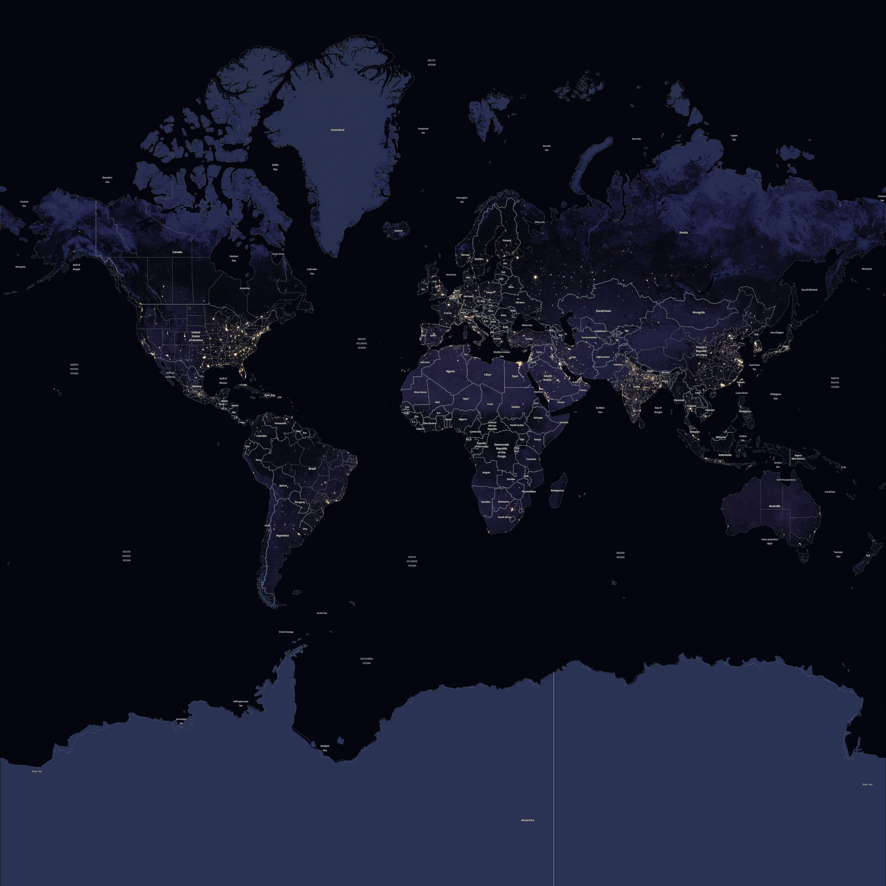

# NASA BlackMarble Tiles - Labeled

This NPM package provides access to tiles from the NASA BlackMarble dataset. These tiles feature detailed night representations of Earth's surface. Labels originate from Open Street Map data.



## Usage

The tiles can be used offline, hosted on your own servers, or accessed via the included CDN link for easy integration into web mapping applications.


To install the tiles offline via [NPM](https://www.npmjs.com/package/@freetiler/nasa-blackmarble-labeled), use:
```
npm install @freetiler/nasa-blackmarble-labeled
```

### CDN Links

You can use any NPM or Github CDN to serve the tiles. 

```
GitHub CDNs - Zoom 0-8: 
 - https://cdn.jsdelivr.net/gh/freetiler/nasa-blackmarble-labeled/tiles/{z}/{x}/{y}.jpeg
 - https://cdn.statically.io/gh/freetiler/nasa-blackmarble-labeled/main/tiles/{z}/{x}/{y}.jpeg
```

## Tile Specs:

- **Minimum Zoom Level**: 0
- **Maximum Zoom Level on NPM**: 7
- **Maximum Zoom Level on Github**: 8
- **Projection Used**: EPSG:3857
- **Tile Size**: 256x256
- **Tile Format**: JPEG
- **Attribution**: "FreeTiler.com | NASA | OSM Contributors"

## License

NASA Open Data Policy:
NASA has an open data policy, and you are free to use the imagery from GIBS as you see fit.  Citations are not required but are requested and highly appreciated.  Please see the “Data Use Policy and Acknowledgements” section here for more information:
https://www.earthdata.nasa.gov/eosdis/science-system-description/eosdis-components/gibs

Open StreetMaps License:
This dataset is made available under the Open Database License: http://opendatacommons.org/licenses/odbl/1.0/. Any rights in individual contents of the database are licensed under the Database Contents License: http://opendatacommons.org/licenses/dbcl/1.0/

## Disclaimer

This package is provided "as is", without warranty of any kind. Use at your own risk.
